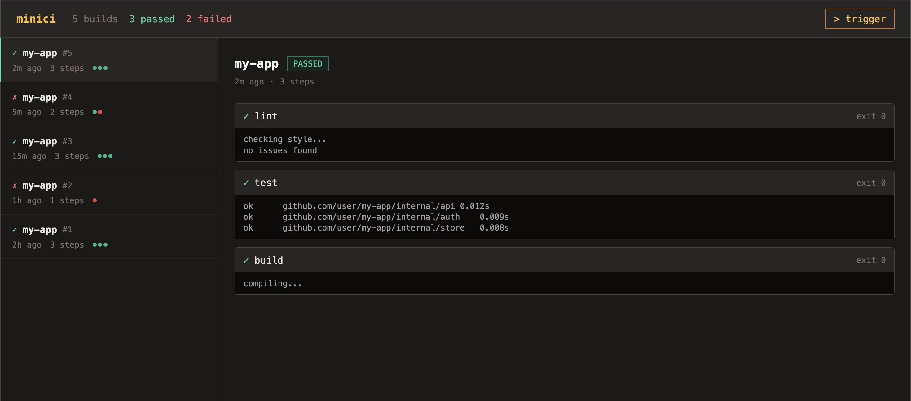

<div align="center">


# riverroot

**Run each pipeline step on the host or in a container, and see the builds**

Describe your steps in a YAML file, start the server, and open the dashboard to see how each build went.

</div>

## Demo

The dashboard lists builds on the left; selecting one shows its steps and their output.



## Install

```bash
git clone https://github.com/HeyItWorked/riverroot && cd riverroot
```

Requires Go 1.26 and, for steps that name an image, Docker.

## Quickstart

Run it from the repository root, where `pipeline.yaml` already defines three steps:

```bash
mkdir -p data
go run ./cmd/riverroot
```

```text
riverroot running on http://localhost:8080
```

Open http://localhost:8080 for the dashboard, then trigger a build:

```bash
curl -X POST http://localhost:8080/builds
```

The `test` and `vet` steps run in parallel, `build` runs after them, and each one's output shows on the build's page.

## Configuration

`pipeline.yaml` names the pipeline and lists its steps:

```yaml
name: my-app
steps:
  - name: test
    command: go test ./...
    image: golang:1.26
    parallel: true
  - name: vet
    command: go vet ./...
    parallel: true
  - name: build
    command: go build ./...
```

| Field | Type | Description |
| --- | --- | --- |
| `name` | string | Label shown for the step in the dashboard |
| `command` | string | Shell command the step runs |
| `image` | string | Docker image to run the command in; runs as a host process when omitted |
| `parallel` | bool | Run alongside the other parallel steps instead of waiting its turn |

Consecutive steps marked `parallel` run together. The next sequential step waits for all of them.

## API

| Method | Path | Description |
| --- | --- | --- |
| `GET` | `/builds` | List builds, newest first |
| `GET` | `/builds/{id}` | One build with its steps and output |
| `POST` | `/builds` | Trigger a build of the current pipeline |
| `GET` | `/` | The embedded dashboard |

## Notes

- **Set `DEMO=1`** to seed example builds and disable `POST /builds`, so visitors cannot execute commands on the host.
- **There is no authentication.** The API and dashboard are for local use, not a shared network.
- **Builds are stored in SQLite** at `data/riverroot.db`.
- **Tests run with `go test ./...`.** Steps without an image run on the host, so the runner and pipeline tests need `bash`.
