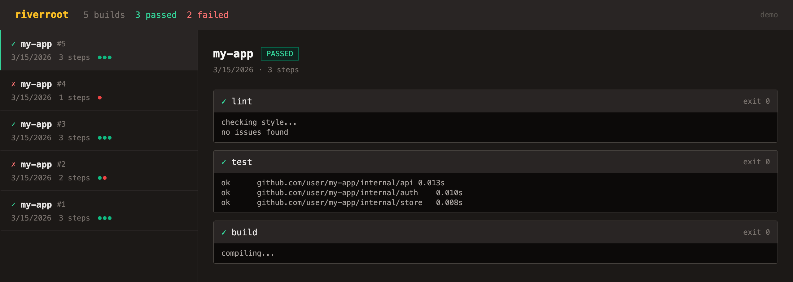
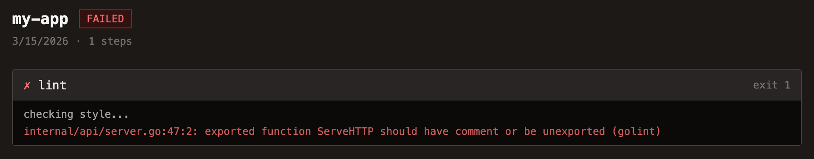

<h1 align="center">
   riverroot
</h1>

<p align="center">
  
  
  
  
</p>

<p align="center">
  <strong>A small self-hosted CI server in Go.</strong><br/>
  Describe your steps in one YAML file, run each on the host or in a Docker container, and see every build in a dashboard.
</p>

<h3 align="center"><a href="https://heyitworked.github.io/RiverRoot/"><ins>Open the live demo</ins></a></h3>

<p align="center">
  
</p>

## Features

<table>
<tr>
<td width="50%" valign="middle">

### One YAML File

A pipeline is a name and a list of steps. Each step is a shell command with a label for the dashboard.

</td>
<td width="50%">

```yaml
name: my-app
steps:
  - name: test
    command: go test ./...
    image: golang:1.26
    parallel: true
  - name: vet
    command: go vet ./...
    parallel: true
  - name: build
    command: go build ./...
```

</td>
</tr>
<tr>
<td width="50%" valign="middle">

### Parallel Where It Helps

Consecutive steps marked `parallel` run together as one batch. The next sequential step waits for the whole batch to finish.

</td>
<td width="50%">

```text
test ─┐
      ├──▶ build
vet  ─┘
```

</td>
</tr>
<tr>
<td width="50%" valign="middle">

### On the Host or in a Container

Leave out `image` and the step runs through `bash` in the working directory. Name an image and it runs in Docker instead, with the repo mounted at `/workspace` and the container removed afterwards. Every step gets a five-minute timeout.

</td>
<td width="50%">

```yaml
- name: test            # in a container
  command: go test ./...
  image: golang:1.26

- name: build           # on the host
  command: go build ./...
```

</td>
</tr>
<tr>
<td width="50%" valign="middle">

### Stops at the First Failure

A non-zero exit fails the build and later steps never start. A step that couldn't run at all is recorded separately from one that ran and failed.

</td>
<td width="50%">
  
</td>
</tr>
<tr>
<td width="50%" valign="middle">

### Every Build, Saved

Builds and their steps land in SQLite at `data/riverroot.db`, written in one transaction per build. Output, exit codes, and errors are kept per step.

</td>
<td width="50%">

```bash
sqlite3 data/riverroot.db \
  "select pipeline, failed, created_at from builds"
```

</td>
</tr>
<tr>
<td width="50%" valign="middle">

### A Small REST API

List builds, fetch one with its steps, or trigger a new run. The dashboard reads the same endpoints.

</td>
<td width="50%">

```bash
curl -X POST localhost:8080/builds   # run the pipeline
curl localhost:8080/builds           # newest first
curl localhost:8080/builds/<id>      # steps and output
```

</td>
</tr>
</table>

**Also in the box:**

- **One binary** — the dashboard is embedded with `go:embed`, so there are no files to deploy beside it.
- **Demo mode** — `DEMO=1` seeds example builds and turns off `POST /builds`, so a public instance can't run commands.
- **Pure-Go SQLite** — `modernc.org/sqlite`, so no cgo or system library is needed.
- **Server timeouts** — explicit read, write, and idle limits instead of `http.ListenAndServe`'s none.
- **A dev container** — Go with Docker-in-Docker, so container steps work inside it too.

---

## Built With

<p>
  <a href="https://go.dev"><kbd> Go</kbd></a> &nbsp;
  <a href="https://pkg.go.dev/modernc.org/sqlite"><kbd> SQLite</kbd></a> &nbsp;
  <a href="https://docs.docker.com/reference/api/engine/sdk/"><kbd> Docker SDK</kbd></a> &nbsp;
  <a href="https://pkg.go.dev/gopkg.in/yaml.v3"><kbd> yaml.v3</kbd></a> &nbsp;
  <a href="https://pkg.go.dev/golang.org/x/sync/errgroup"><kbd> errgroup</kbd></a> &nbsp;
  <a href="https://vuejs.org"><kbd> Vue</kbd></a> &nbsp;
  <a href="https://tailwindcss.com"><kbd> Tailwind</kbd></a>
</p>

---

## Quick Start

**Requires:** Go 1.26+, `bash`, and Docker only for steps that name an image.

```bash
git clone https://github.com/HeyItWorked/RiverRoot.git && cd RiverRoot
mkdir -p data
go run ./cmd/riverroot          # riverroot running on http://localhost:8080
```

Open **http://localhost:8080**, then trigger a build from the dashboard or with `curl -X POST localhost:8080/builds`. The repo's own `pipeline.yaml` runs `test` and `vet` in parallel, then `build`.

<details>
<summary><strong>pipeline.yaml fields</strong></summary>

<br/>

| Field | Type | Description |
| --- | --- | --- |
| `name` | string | Label shown for the step in the dashboard |
| `command` | string | Shell command the step runs |
| `image` | string | Docker image to run the command in; runs on the host when omitted |
| `parallel` | bool | Run alongside the neighboring parallel steps instead of waiting its turn |

</details>

<details>
<summary><strong>API reference</strong></summary>

<br/>

| Method | Path | Description |
| --- | --- | --- |
| `GET` | `/builds` | List builds, newest first |
| `GET` | `/builds/{id}` | One build with its steps and output |
| `POST` | `/builds` | Run the current pipeline and save the result; `403` in demo mode |
| `GET` | `/` | The embedded dashboard |

</details>

---

## Limits and What's Next

- **No authentication.** The API and dashboard are for local use, not a shared network.
- **Builds are triggered by hand.** `POST /builds` runs the whole pipeline before it responds. A git poller (`internal/git`) and a per-build log store with `tail -f`-style following (`internal/store/logs.go`) are built and tested, but the server doesn't start them yet.
- **Output shows up once the whole build finishes**, not line by line while it runs.
- **The dashboard loads Vue and Tailwind from CDNs**, so it needs an internet connection.
- **`DEMO=1` seeds two builds on every start**, so restarts add more.

## Development

```bash
go test ./...
```

Steps without an image run through `bash`, so the runner and pipeline tests need it. The dev container is the reference environment. The hosted demo is a static copy of the dashboard in `docs/`, reading `docs/data.json` instead of the API.
